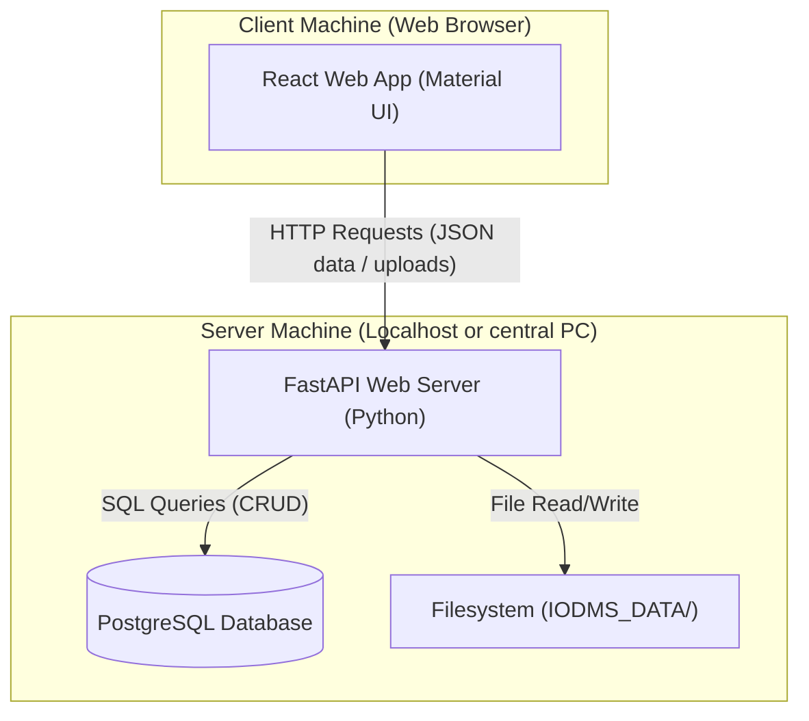
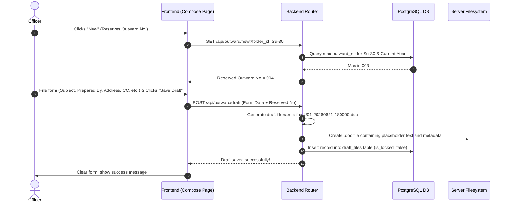
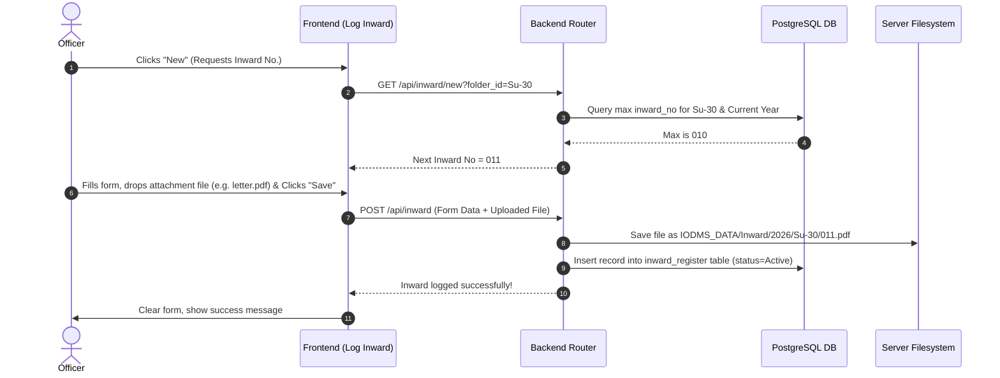
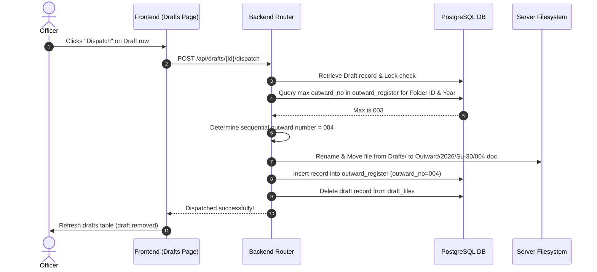

# High Level Design (HLD) - Inward/Outward Document Management System (IODMS)

This document provides a high-level overview of the structure and flow of the IODMS. It is designed to be easily understood by a beginner.

---

## 1. System Architecture

The IODMS is built using a classic **Client-Server Architecture**. Below is a diagram showing how the different parts connect to each other:



### Layer Responsibilities

1. **Frontend (React + Material UI)**
   - Runs in the user's web browser (Chromium 109+).
   - Responsible for showing the user interface (forms, tables, dashboard).
   - Collects user inputs, validates them, and sends them to the backend server.
   - Enforces view-only watermarks and restricts actions for the **Auditor** role.

2. **Backend Server (FastAPI)**
   - Runs on the central server machine.
   - Receives commands and data from the frontend.
   - Validates data, manages user authentication, and coordinates saving/retrieving data from the database and the filesystem.

3. **Database (PostgreSQL)**
   - Stores all structured information (user accounts, address book, metadata about inward/outward documents).
   - Ensures data is structured and searchable quickly.

4. **Filesystem (IODMS_DATA/)**
   - A folder on the server's hard drive where the actual documents (Word drafts, scanned PDFs/Images) are stored.
   - Organised systematically by year and Folder ID.

---

## 2. File System Layout & Numbering Rules

### Filesystem Directory Structure
All documents are stored within a single configured directory (default: `IODMS_DATA/`).

```
IODMS_DATA/
├── Inward/
│   └── {Year}/
│       └── {Folder ID}/            <-- e.g., Su-30, LCA
│           └── 001.pdf, 002.docx   <-- Named by sequential number, original extension preserved
├── Outward/
│   └── {Year}/
│       └── {Folder ID}/
│           └── 001.doc, 002.doc    <-- Named by sequential number, always .doc extension
└── Drafts/
    └── {Year}/
        └── {Folder ID}/
            └── fax-{UserID}-{YYYYMMDD}-{HHMMSS}.doc <-- Draft filenames (never renumbered)
```

### Numbering Rules
- **Yearly Reset**: Every January 1, the sequential number for both Inward and Outward registers resets to `001` for each combination of Year and Folder ID.
- **Independent Sequences**: Inward number `001` for `Su-30` in 2026 is completely separate from Outward number `001` for `Su-30` in 2026.
- **Padding**: Numbers between `001` and `999` are padded with leading zeros to be exactly 3 digits. From `1000` onwards, numbers grow naturally without padding (e.g., `1000`, `1001`).

---

## 3. Core Workflow Traces

### Trace 1: Compose Outward -> Save Draft
This trace shows what happens when an officer drafts a new outward document:



---

### Trace 2: Log Inward -> Save
This trace shows how an incoming document is logged:



---

### Trace 3: Dispatch Draft -> Move File to Outward Register
This trace shows how a draft is finalised and officialised as an Outward entry:


